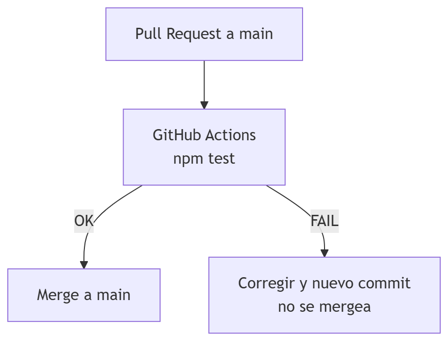
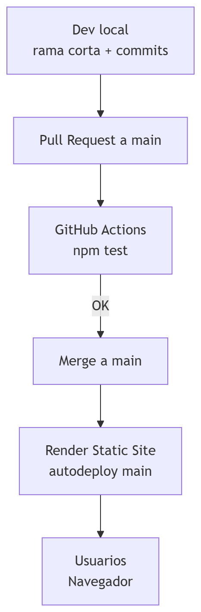

# Trunk-Based Development Workshop Template

Guía completa, pensada como base para un taller práctico de desarrolladores sobre Trunk-Based Development (TBD) usando Git + GitHub y herramientas open source para CI, tests y despliegue.

Este repositorio es la base para un taller práctico de **Trunk-Based Development (TBD)** usando:

 - Git y GitHub
 - Feature toggles (banderas de funcionalidad)
 - HTML, CSS y JavaScript (sin frameworks)
 - Jest + JSDOM para pruebas
 - GitHub Actions para CI
 - Render para despliegue estático gratuito

La idea es que el código sea lo más simple y universal posible para cualquier desarrollador, sin importar su lenguaje principal, pero que el flujo sea representativo de un pipeline DevOps real con TBD.

---

## 1. Objetivo del taller

Al finalizar el taller, deberías ser capaz de:

- Entender los principios básicos de **Trunk-Based Development**.
- Trabajar con:
  - Una **rama principal (`main`)** siempre desplegable.
  - **Ramas cortas** de vida muy breve (horas / 1–2 días).
  - **Pull Requests pequeños** e integraciones frecuentes.
- Usar **feature toggles** para integrar código incompleto sin romper `main`.
- Diseñar y leer un flujo DevOps completo:
  - CODE → BUILD/TEST → DEPLOY → RUN, todo conectado a main.
- Ver cómo un cambio de configuración (**config/features.json**) puede “encender” o “apagar” funcionalidades sin cambios de código.

---

## 2. Descripción de la mini app

Este repo contiene una mini aplicación web muy simple:

1. **Calculadora básica**  
   - Permite sumar dos números.  
   - Siempre visible para todos los usuarios.

2. **Color picker (nueva funcionalidad)**  
   - Permite elegir un color y ver una vista previa.  
   - Está **controlada por un feature toggle** (`color_picker`) definido en `config/features.json`.

Estructura de archivos:

```text
index.html             # Estructura de la página (HTML)
styles.css             # Estilos básicos (CSS)
app.js                 # Lógica de la calculadora y del color picker (JS)
config/features.json   # Definición de feature toggles
tests/app.test.js      # Pruebas unitarias / DOM con Jest + JSDOM
jest.config.cjs        # Configuración de Jest
package.json           # Dependencias (Jest, jest-environment-jsdom, etc.)
.github/workflows/ci.yml  # Pipeline de CI (GitHub Actions)
```

## 3. Arquitectura y diseño
### 3.1. Vista lógica de la app

### 3.2. Diagrama de flujo de toggles

### 3.3 Diagrama de componentes


---

## 4. Flujo DevOps + Trunk-Based Development
### 4.1. Ciclo DevOps completo

### 4.2. Flujo de desarrollo con TBD


---

## 5. Tests (Jest + JSDOM)
El proyecto incluye pruebas:

1. Unitarias de lógica (sin DOM):
   * sumTwoNumbers(a, b): Suma numérica, lanza error si los valores no son numéricos.
   * shouldShowFeature(features, featureName): Decide si un toggle está activo.

2. Pruebas con DOM usando JSDOM:
   * setupCalculator(): Monta listeners sobre el DOM.
   * Se valida que:  
  Click en “Sumar” con números válidos → Resultado: N.  
  Click con datos inválidos → mensaje de error.

Arquitectura de tests:
tests/
  app.test.js          # Tests de lógica + DOM
jest.config.cjs        # Usa testEnvironment = 'jsdom'

### 5.1. Ejecutar los tests en local
npm install  
npm test

---

## 6. CI con GitHub Actions
El workflow .github/workflows/ci.yml ejecuta:
* npm install  
* npm test  

en cada:
* push a main  
* pull_request hacia main  

Ejemplo de pipeline (simplificado):


Recomendación:

Configurar protección de rama en GitHub para main:
 * Requerir PR.
 * Requerir que el workflow de CI pase.
 * (Opcional) Exigir al menos 1 review.

---

## 7. Despliegue
Esta mini app es puramente estática (HTML, CSS, JS y JSON), así que se puede desplegar fácilmente usando un Static Site en Render:  
https://tbd-workshop-template.onrender.com/

### 7.1 7.1. Diagrama de despliegue


### 7.2. Crear Static Site en Render
1. Crear cuenta en Render (plan gratuito).
2. Conectar cuenta de GitHub.
3. En el panel de Render, New + → Static Site.
4. Seleccionar este repositorio.
5. Configurar:
   * Name: tbd-workshop-demo (por ejemplo)
   * Branch: main.
   * Build Command:
     * npm test (para bloquear deploy si las pruebas fallan).
     * O dejar vacío si solo quieres servir los archivos.
     * Publish Directory: . (raíz del repo).
6. Crear el Static Site.
7. Render generará una URL pública tipo:  
https://tbd-workshop-demo.onrender.com

### 7.2 Auto‑deploy en cada cambio a main
En la configuración del Static Site, activar Auto-Deploy para main.


---

## 8. Cómo trabajar con este repo (paso a paso)
### 8.1. Flujo recomendado (TBD)
1. Crear issue en GitHub
2. Crear rama corta desde main:  
   git checkout main  
   git pull origin main  
   git checkout -b dev/\<iniciales\>/\<tarea\>
3. Cambiar código.  
   Si la funcionalidad está incompleta: protegerla con un toggle en config/features.json.
4. Probar en local
5. Ejecutar tests
6. Commit + push  
   git add .  
   git commit -m "feat: <descripción corta>"  
   git push origin dev/\<iniciales\>/\<tarea\>
7. Crear Pull Request a main en GitHub.
8. Ver que CI pase
9. Hacer merge a main y borrar la rama

---

## 9. Checklist final de Trunk-Based Development

Todos los días deberíamos poder responder “sí” a:

- [x] ¿main está desplegable y con tests verdes?  
- [ ] ¿Mis cambios de hoy se integran (o se integraron) a main?  
- [ ] ¿He evitado ramas que vivan más de 1–2 días?  
- [ ] ¿He dividido la tarea en pasos pequeños?  
- [ ] ¿Cualquier funcionalidad incompleta está protegida por un feature toggle?  
- [ ] ¿No he fusionado nada a main saltándome CI?  
- [ ] ¿He borrado mis ramas una vez fusionadas?  

Si la mayoría de respuestas son “sí”, estás muy cerca de practicar Trunk-Based Development de forma consistente.